## *Enidev911*

### *Calculator simple*

  <a href="./Calculator">Calculadora</a>

  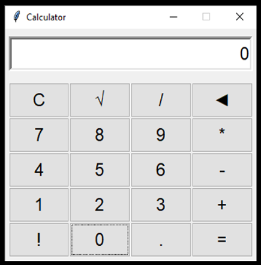
     &nbsp;&nbsp;&nbsp;&nbsp;&nbsp;
  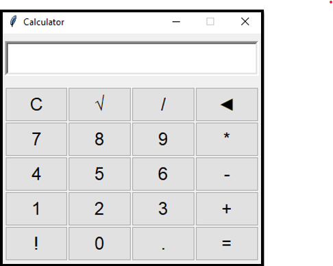

---

### *Digital Clock*

  <a href="./Reloj_Digital">Reloj Digital</a>

  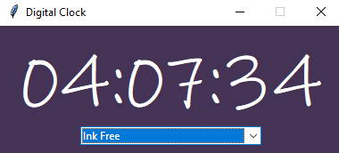
  &nbsp;&nbsp;&nbsp;
  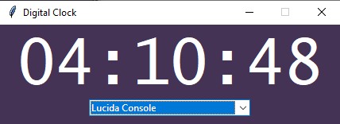

  
  &nbsp;&nbsp;&nbsp;
  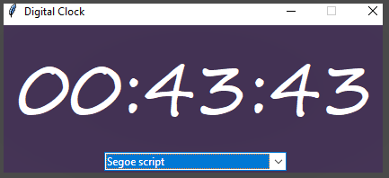

---

### *Calculator Age*

  <a href="./calculator_age">Caculadora edad</a>

  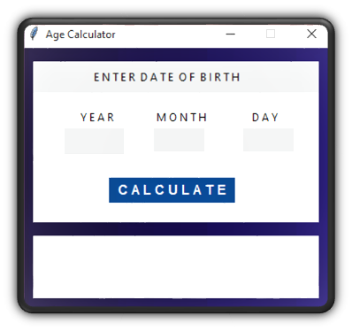
     &nbsp;&nbsp;&nbsp;&nbsp;&nbsp;
  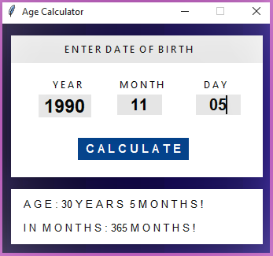

---

### *Login Tk*

  <a href="./Login_Tkinter">Login Tk</a>

  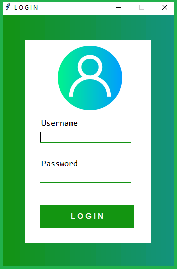
   &nbsp;&nbsp;&nbsp;&nbsp;&nbsp;
  

---

### *Modern Clock*

  <a href="./Modern_clock">Modern Digital Clock</a>

<h2>Mode fullscreen (F11)</h2>

  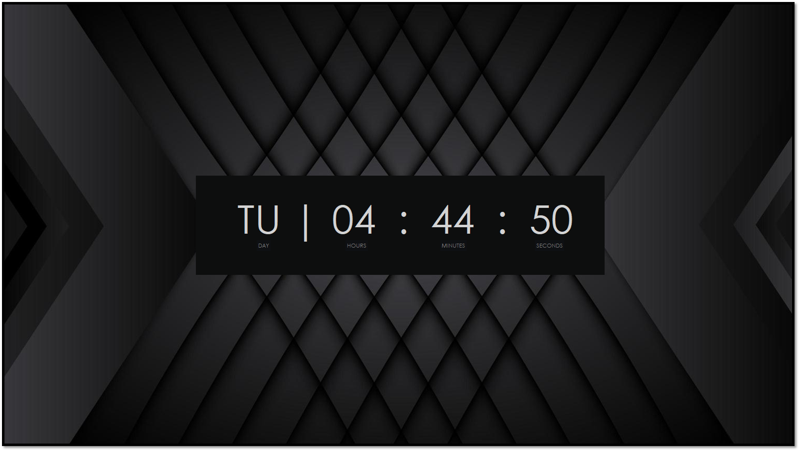

 
<h2>Normal Mode (Escape)</h2>

  

---

### *Splash charge screen*

  <a href="./Splash_screen">Charge Screen</a>

  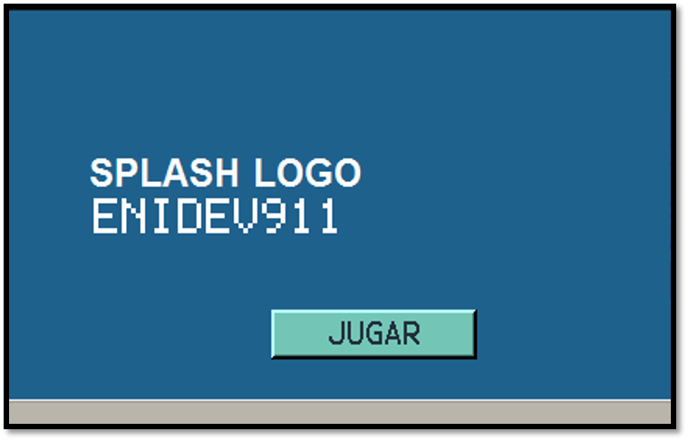
  &nbsp;&nbsp;&nbsp;
  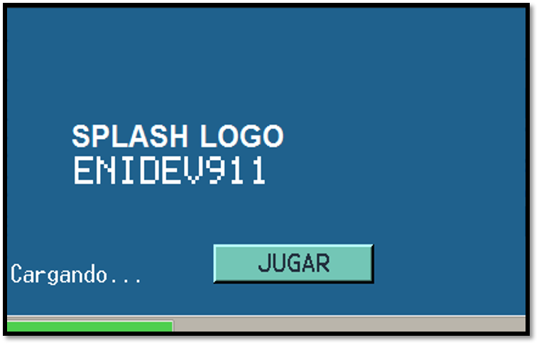

  
  &nbsp;&nbsp;&nbsp;
  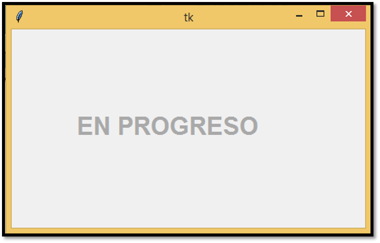

### *POKEDEX CANVAS*

  <a href="./pokedex">Charge Screen</a>

  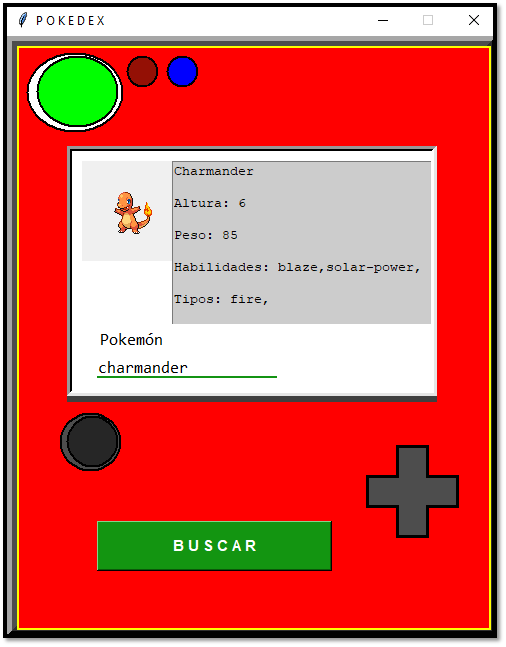
  &nbsp;&nbsp;
  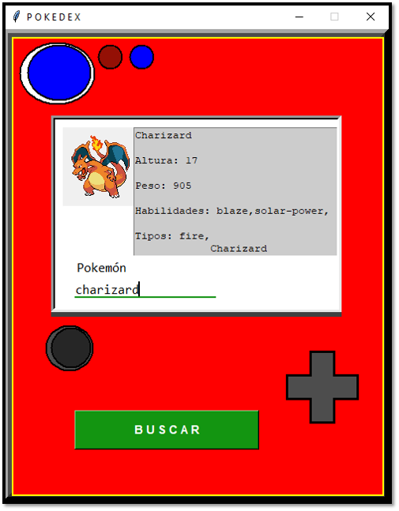

