## *Enidev911*  

### *Simple calculator*

  
     &nbsp;&nbsp;&nbsp;&nbsp;&nbsp;
  

<i><b style="font-size: 18px; color:#900C3F">Code</b> :arrow_right: </i> 

---

### *Digital Clock*

  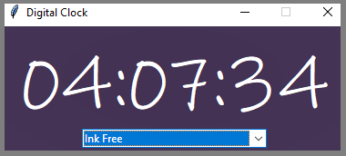
  &nbsp;&nbsp;&nbsp;
  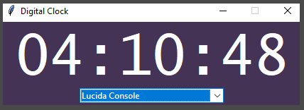

  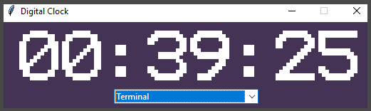
  &nbsp;&nbsp;&nbsp;
  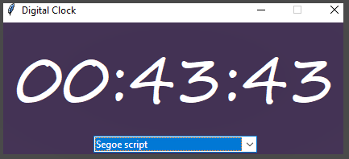

<i><b style="font-size: 18px; color:#900C3F">Code :arrow_right: 

---

### *Calculator Age*

  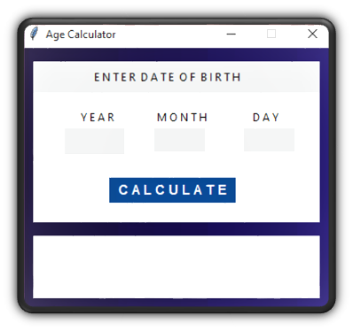
     &nbsp;&nbsp;&nbsp;&nbsp;&nbsp;
  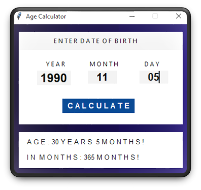

<i><b style="font-size: 18px; color:#900C3F">Code :arrow_right: 

---

### *Login Tk*

  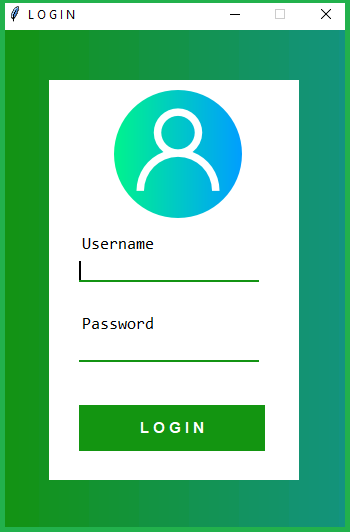
   &nbsp;&nbsp;&nbsp;&nbsp;&nbsp;
  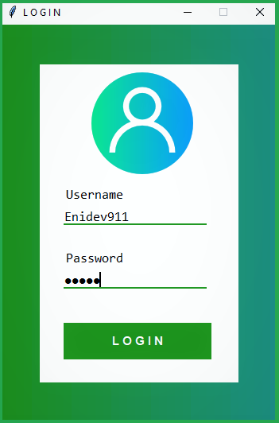

<i><b style="font-size: 18px; color:#900C3F">Code :arrow_right: 

---

### *Modern Clock*

***Mode fullscreen (F11)***

  

 

***Normal Mode (Escape)***

  

<i><b style="font-size: 18px; color:#900C3F">Code :arrow_right: 

---

### *Splash charge screen*

  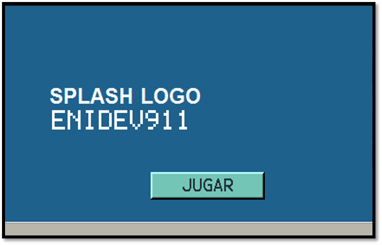
  &nbsp;&nbsp;&nbsp;
  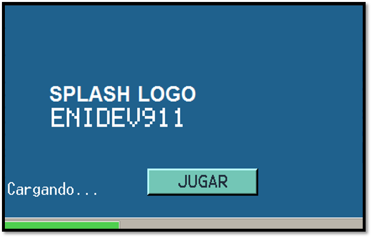

  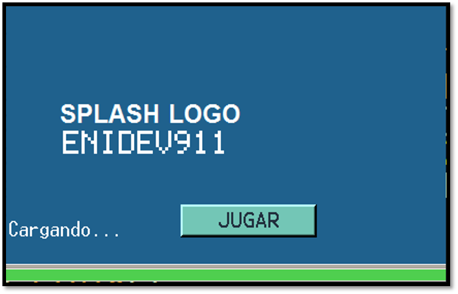
  &nbsp;&nbsp;&nbsp;
  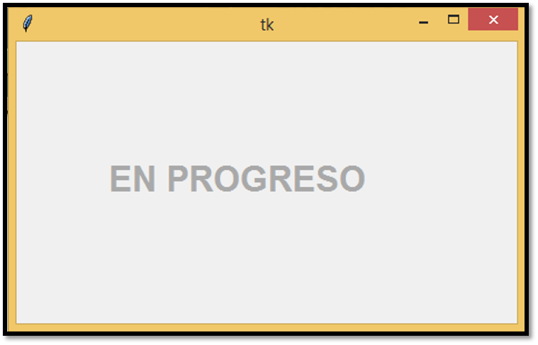

  
<i><b style="font-size: 18px; color:#900C3F">Go to code</b> :arrow_right: </i>

### *POKEDEX CANVAS*

  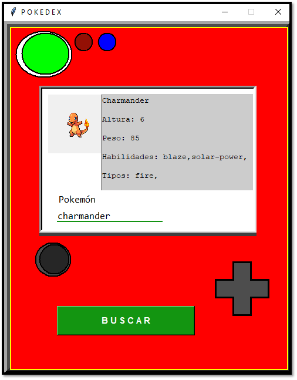
  &nbsp;&nbsp;
  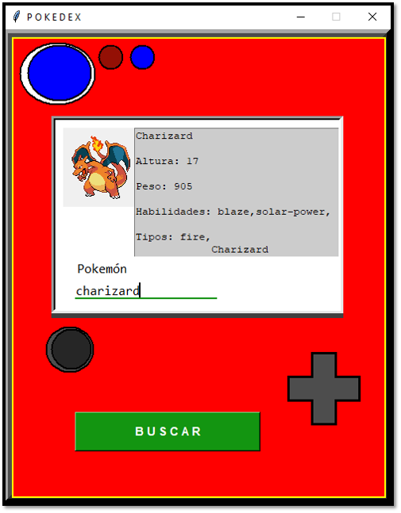

  
<i><b style="font-size: 18px; color:#900C3F">Go to code</b> :arrow_right: </i>

---

### *To-Do List App*

  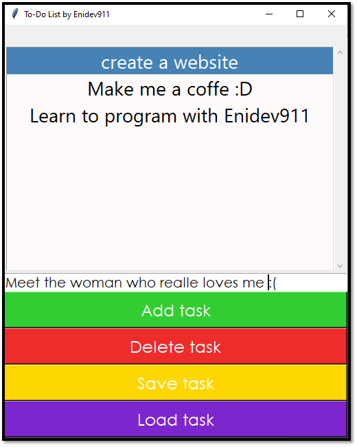
  &nbsp;&nbsp;
  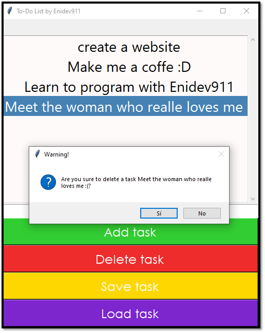

  
<i><b style="font-size: 18px; color:#900C3F">Go to code</b> :arrow_right: </i>

