

  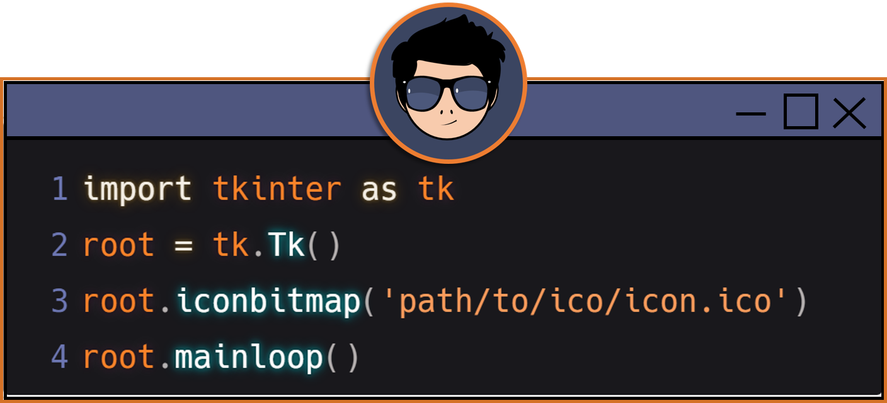

<h2 align="center">Tkinter-Projects</h2> 

  
  &nbsp;&nbsp;&nbsp;
  
  &nbsp;&nbsp;&nbsp;
  

<!-- Title -->
<h3 align="center">Basic Calculator</h3> 
<!-- Images -->

  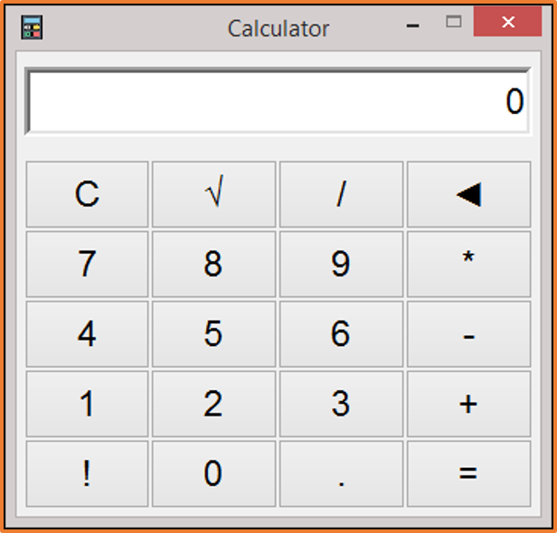
  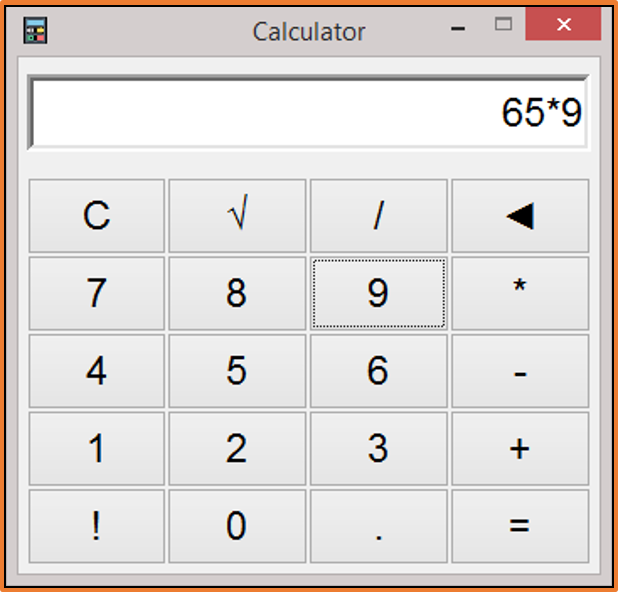

<!-- Go project -->

  <a href="./projects/basic_calculator">
    
   

--- 

<!-- Title -->
<h3 align="center">Calculator : Poo</h3> 
<!-- Images -->

  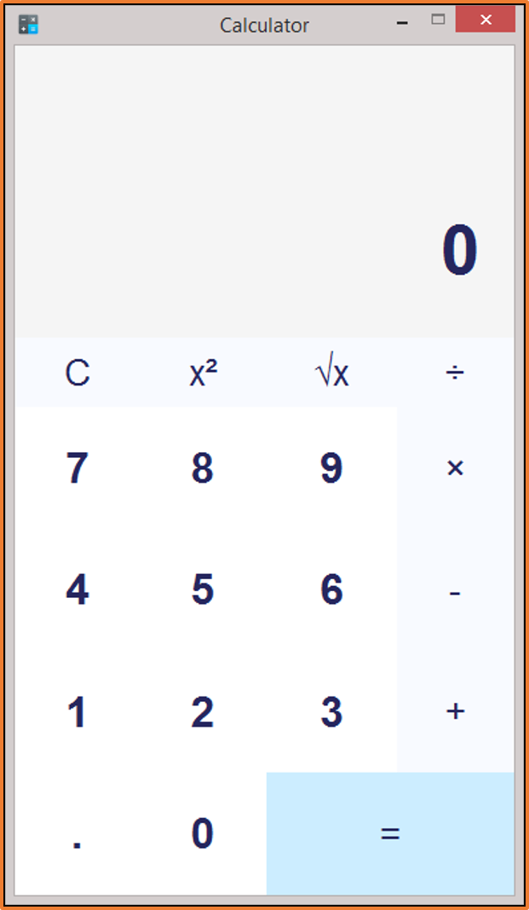
  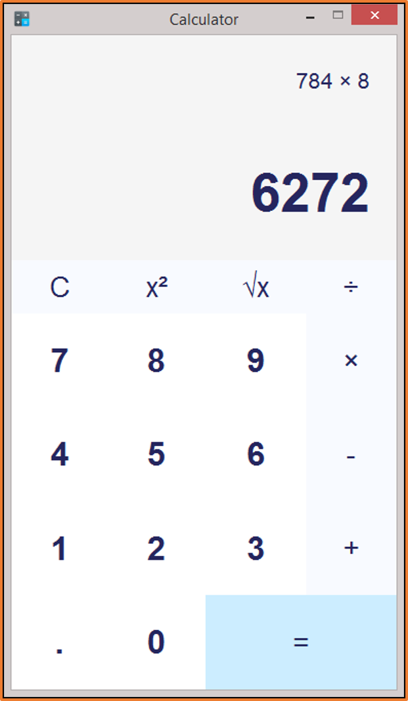

<!-- Go project -->

  <a href="./projects/calculator_poo">
    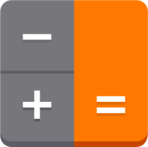 
    

--- 

<!-- Title -->
<h3 align="center">Calculator age</h3> 
<!-- Images -->

  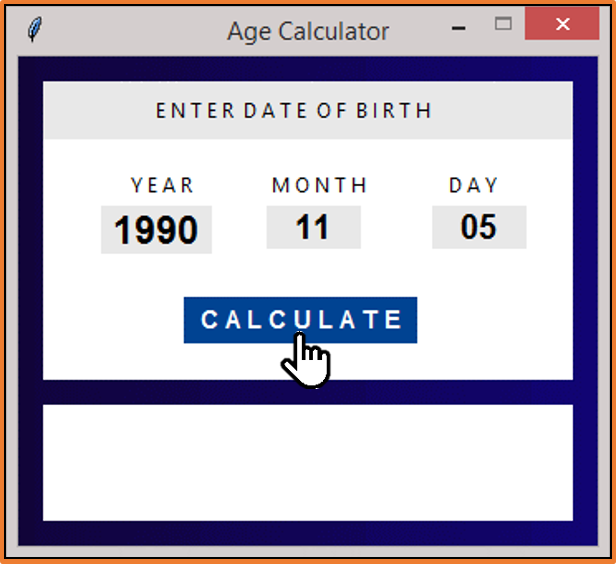
  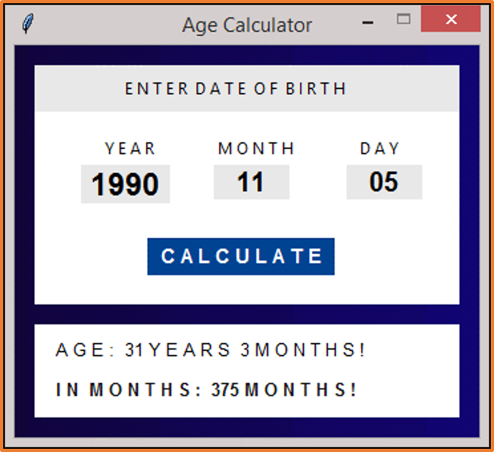

<!-- Go project -->

  <a href="./projects/calculator_age">
     
    </a>

--- 

<!-- Title -->
<h3 align="center">Login : bg-gradient</h3> 
<!-- Images -->

  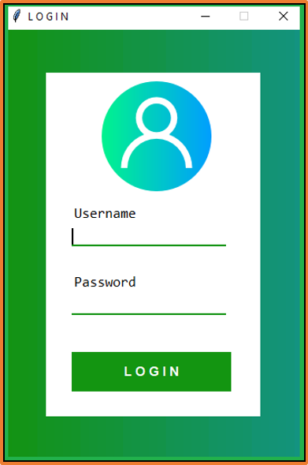
  

<!-- Go project -->

  <a href="./projects/login_tk_a">
     
    </a>

--- 

<!-- Title -->
<h3 align="center">Clock : modern-dark</h3> 

- ***Mode fullscreen (F11)***
<!-- Images -->

  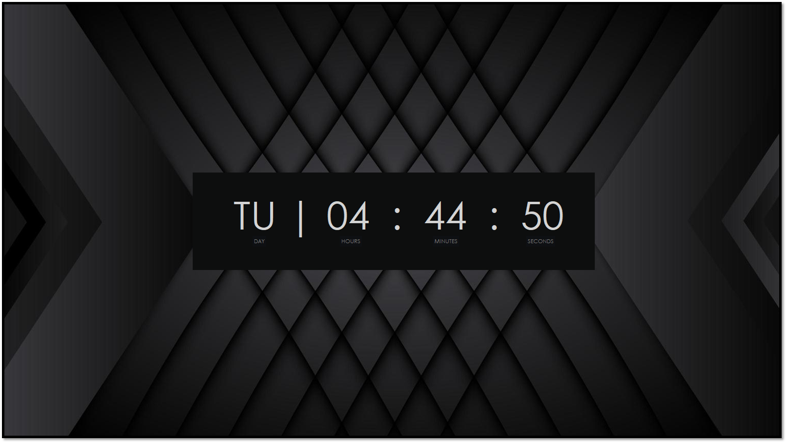

- ***Normal Mode (Escape)***

  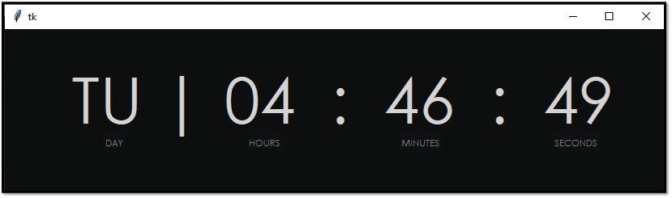

<!-- Go project -->

  <a href="./projects/login_tk_a">
     
    </a>

<!--

  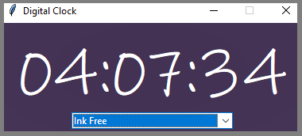
  &nbsp;&nbsp;&nbsp;
  

  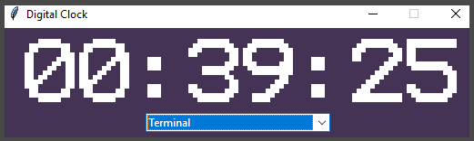
  &nbsp;&nbsp;&nbsp;
  

-->
