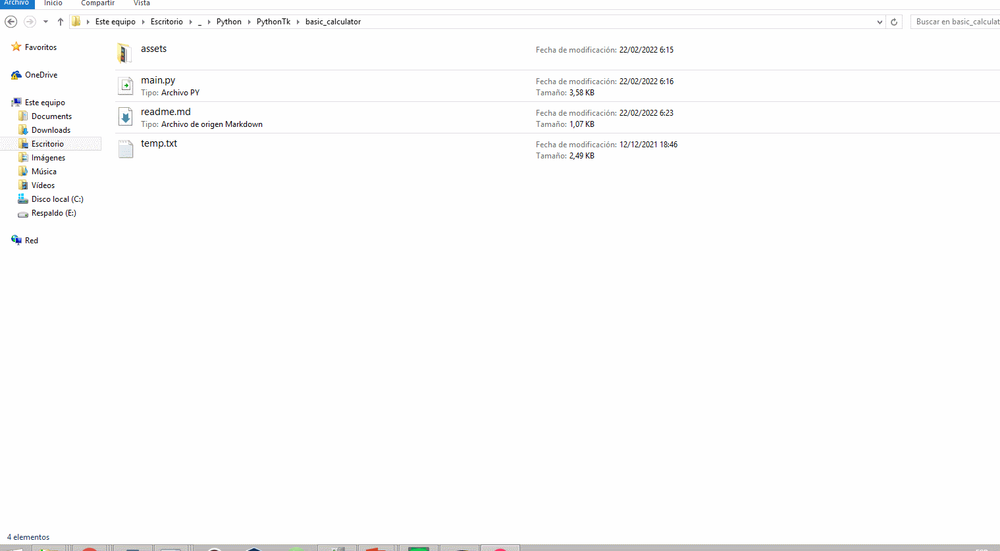

## Descripción

Esta aplicación es una calculadora básica, implementa una serie de técnicas para no repetir el mismo procedimiento en la creación de los widgets. 

## Ejecutar

Esta aplicación no utiliza librerías externas, es decir, que no necesita instalar nada.  
Para ejecutar el script principal con:  

```bat
python main.py
```

## Demo


<p align="center">
	
</p>


## Compilar

Si desea compilar la aplicación, asegurese de que el script principal se llame `main.py`, solo debe ejecutar el archivo `compiler.bat` en plataforma Windows.

